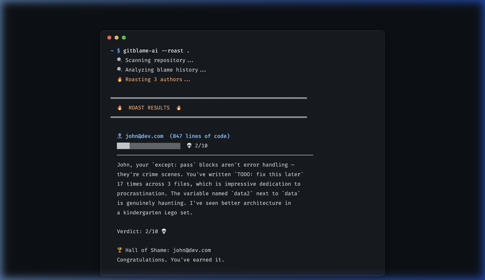

# 🔥 gitblame-ai

[](https://github.com/spidervirus/gitblame-ai)
[](https://opensource.org/licenses/MIT)
[](https://www.python.org/downloads/)

**AI-powered code roaster. `git blame` was personal — now it's savage. Let Claude roast your team's worst code.**



---

## What is this?

`gitblame-ai` is a CLI tool that scans your repository using `git blame`, identifies each author's most *suspicious* code (based on heuristics like TODOs, bare excepts, and long-forgotten spaghetti), and sends it to Claude AI for a brutally honest roast.

**Topics:** `python`, `cli`, `ai`, `code-review`, `git`, `claude`, `humor`, `roast`, `developer-tools`

Perfect for:
- 🤣 Team standups
- 💀 Code review sessions
- 🏆 Friday afternoon vibes
- 😬 Holding people accountable in the funniest way possible

---

## How it works

1. Runs `git blame --line-porcelain` on all code files.
2. Groups lines by author and filters out uncommitted changes.
3. Scores each line for "badness" (TODOs, bare excepts, long lines, etc.) using modular heuristics.
4. Sends the worst offenders to Claude AI (using `claude-3-5-sonnet`).
5. Renders a beautiful terminal roast card per author.

---

## Installation

Clone the repo and install it in editable mode:

```bash
git clone https://github.com/spidervirus/gitblame-ai.git
cd gitblame-ai
pip install -e .
```

Set your Anthropic API key:

```bash
export ANTHROPIC_API_KEY=sk-ant-...
```

---

## Usage

```bash
# Roast the whole repo (default: top 3 authors)
gitblame-ai .

# Roast a single file
gitblame-ai gitblame_ai/main.py

# Different modes
gitblame-ai . --mode gentle   # Kind but disappointed
gitblame-ai . --mode poetic   # Shakespearean tragedy
gitblame-ai . --mode roast    # Pure savagery (default)

# Top 5 authors
gitblame-ai . --top 5
```

---

## Modes

| Mode | Vibe |
|------|------|
| `roast` | Brutal, savage, funny. No mercy. |
| `gentle` | Constructive. Like a disappointed parent. |
| `poetic` | Shakespeare reviews your spaghetti code. |

---

## Project Structure

```text
gitblame-ai/
├── gitblame_ai/       # Core package
│   ├── git.py         # Git blame parsing & file discovery
│   ├── ai.py          # Anthropic API integration
│   ├── roaster.py     # Heuristics & Terminal UI
│   └── main.py        # CLI Entry point
├── pyproject.toml     # Package configuration
└── README.md          # This file
```

---

## Requirements

- Python 3.10+
- Git repo
- [Anthropic API key](https://console.anthropic.com)

---

## Contributing

PRs welcome. Especially:
- New "badness" heuristics
- More roast modes
- Export to markdown/HTML report
- GitHub Action integration

---

## License

MIT — roast freely, roast often.

---

> *"With great `git blame` comes great responsibility."*
> — probably someone

### [⭐ Star this if you laughed!](https://github.com/spidervirus/gitblame-ai)
